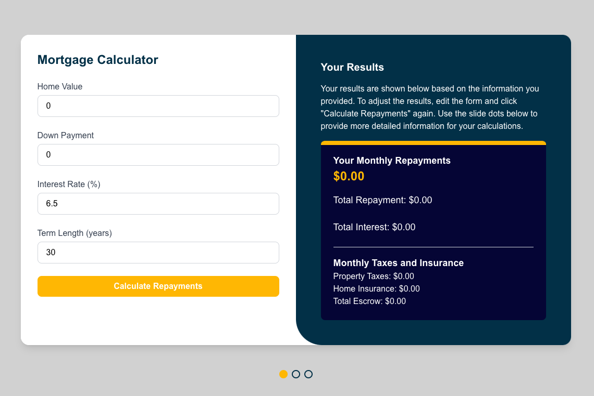

This is a [Next.js](https://nextjs.org) project bootstrapped with [`create-next-app`](https://github.com/vercel/next.js/tree/canary/packages/create-next-app).

## Getting Started

First, run the development server:

```bash
npm run dev
# or
yarn dev
# or
pnpm dev
# or
bun dev
```

Open [http://localhost:3000](http://localhost:3000) with your browser to see the result.

You can start editing the page by modifying `app/page.js`. The page auto-updates as you edit the file.

This project uses [`next/font`](https://nextjs.org/docs/app/building-your-application/optimizing/fonts) to automatically optimize and load [Geist](https://vercel.com/font), a new font family for Vercel.

## Learn More

To learn more about Next.js, take a look at the following resources:

- [Next.js Documentation](https://nextjs.org/docs) - learn about Next.js features and API.
- [Learn Next.js](https://nextjs.org/learn) - an interactive Next.js tutorial.

You can check out [the Next.js GitHub repository](https://github.com/vercel/next.js) - your feedback and contributions are welcome!

## Deploy on Vercel

The easiest way to deploy your Next.js app is to use the [Vercel Platform](https://vercel.com/new?utm_medium=default-template&filter=next.js&utm_source=create-next-app&utm_campaign=create-next-app-readme) from the creators of Next.js.

Check out our [Next.js deployment documentation](https://nextjs.org/docs/app/building-your-application/deploying) for more details.




MainMortgageCalculator.js (Main Front Page)
Includes:

Down Payment Options (feature #13)
Taxes and Insurance Calculator (feature #5)
Core Mortgage Calculator functionality (Mortgage Amount, Term, Rate, Currency).
ExtraPaymentOptions.js
Allows users to input additional payments (monthly, annually, or one-time).

AmortizationSchedule.js
Displays a table or graph showing:

Month-by-month breakdown (Principal, Interest, Remaining Balance).
Cumulative totals.
InterestRateSensitivity.js
Adds a slider to adjust interest rates and dynamically updates the results.

TaxesInsuranceCalculator.js (if separate from the main page)
Estimates property taxes, insurance, and escrow payments.

Renders a dot navigation bar for flipping between slides.

# Find Me!
[Portfolio](https://www.alexwrightportfolio.com/)  | [Project](https://mortgage-calculator-beige-nine.vercel.app/)  | [LinkedIn](www.linkedin.com/in/alexgwright2)  | [GitHub](https://github.com/awright222)